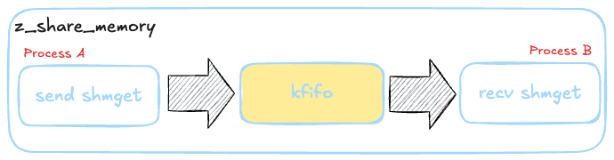

<div align="center">
  
  <h1>z_share_memory</h1>
  <span>English | <a href="./README.zh-CN.md">中文</a></span>
</div>

<div align="center">
  <br/>
  <a href="" target="_blank"></a>
</div>

## ⚡ Introduction

**This is a simple Linux inter-process data transfer solution.** 😊

## 💻 Diagram
The internal structure consists of shared memory and a circular queue. It uses kfifo lock-free queue to implement data transfer between processes.
<div align="center">
  
</div>

## 🚀 How to Use?

**The following operations should be performed from the project root directory. Please ensure you're in the correct directory!**

### **Compile**

```bash
cd z_share_memory
make
cd lib
ls
libtestlib.a  libz_share_memory.a   // Compilation completed
```

### **Test**
#### Complete Test
```bash
------------------------------------------------------------------------------------------------------------------------
Process A
user@42c9c17424fd:/data/work/z_shared_memory$ ./bin/test_send 
Sender process initialized (PID: 248787)
Shared Memory IDs - FIFO: 32780, Data: 32781
Sent message 0: 'First message: Hello World!' (length: 28)
Sent message 1: 'Second message: This is a test' (length: 31)
Sent message 2: 'Third message: Testing shared memory' (length: 37)
Sent message 3: 'Fourth message: With kfifo buffer' (length: 34)
Sent message 4: 'Fifth message: Final test message' (length: 34)
Sender process completed
------------------------------------------------------------------------------------------------------------------------
Process B
user@42c9c17424fd:/data/work/z_shared_memory$ ./bin/test_recv 
Receiver process initialized (PID: 248799)
Shared Memory IDs - FIFO: 32780, Data: 32781
Received message 0: 'First message: Hello World!' (length: 28)
Received message 1: 'Second message: This is a test' (length: 31)
Received message 2: 'Third message: Testing shared memory' (length: 37)
Received message 3: 'Fourth message: With kfifo buffer' (length: 34)
Received message 4: 'Fifth message: Final test message' (length: 34)
Received end marker, seq: 5
Receiver process completed
```

### **Function Usage**
Just four steps
```c
// Step 1: Initialize
// Creator mode
ret = z_shared_memory_init(&shm, BUFFER_SIZE, "test", Z_SHM_CREATE);
// Getter mode
ret = z_shared_memory_init(&shm, BUFFER_SIZE, "test", Z_SHM_GET);

// Step 2: Data Operations
// Receive data
ret = z_shared_memory_recv(&shm, &header, sizeof(header), 2000);
// Send data
ret = z_shared_memory_send(&shm, &header, sizeof(header), 1000);

// Step 3: Release
//
z_shared_memory_free(&shm, Z_SHM_CREATE);
z_shared_memory_free(&shm, Z_SHM_GET);
```

### **File Description**
The key files are only z_kfifo.c and z_share_memory.c
```base
test.c           # Test program
z_kfifo.c        # Buffer queue
z_share_memory.c # Shared memory
z_debug.h        # Debug information toggle
z_tool.h         # Utility macros
z_table_print.c  # Used for the test program's show command to print tables nicely
```

## 🛠️ About

## ❓ FAQ

## 🤝 Development Guide 

## 🚀 Star History 
[](https://starchart.cc/BitStreamlet/z_share_memory)

## 🌟 Contributors
Thanks to everyone who has contributed to z_share_memory! 🎉
<a href="https://github.com//cuixueshe/earthworm/graphs/contributors"></a>

## 🌟 Acknowledgment
**Thank you for taking the time to read our project documentation.**
**If you find this project helpful, please support us with a Star. Thank you!**


