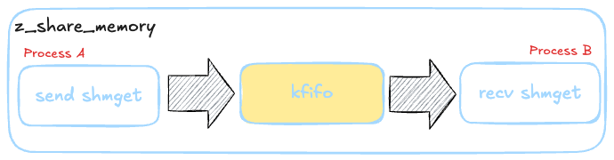

<div align="center">
  
  <h1>z_share_memory</h1>
  <span>中文 | <a href="./README.md">English</a></span>
</div>

<div align="center">
  <br/>
  <a href="" target="_blank"></a>
</div>

## ⚡ 介绍

**这是一个简单的 Linux 进程间传输数据。~** 😊

## 💻 图示
内部结构由共享内存和循环队列组成。使用kfifo无锁队列，实现进程间数据传输。
<div align="center">
  
</div>

## 🚀 如何使用？

**下述操作基于当前项目的根目录，请注意以确保操作正确无误！**

### **编译**

```bash
cd z_share_memory
make
cd lib
ls
libtestlib.a  libz_share_memory.a   //编译完成
```

### **测试**
#### 完成测试
```bash
------------------------------------------------------------------------------------------------------------------------
Process A
user@42c9c17424fd:/data/work/z_shared_memory$ ./bin/test_send 
Sender process initialized (PID: 248787)
Shared Memory IDs - FIFO: 32780, Data: 32781
Sent message 0: 'First message: Hello World!' (length: 28)
Sent message 1: 'Second message: This is a test' (length: 31)
Sent message 2: 'Third message: Testing shared memory' (length: 37)
Sent message 3: 'Fourth message: With kfifo buffer' (length: 34)
Sent message 4: 'Fifth message: Final test message' (length: 34)
Sender process completed
------------------------------------------------------------------------------------------------------------------------
Process B
user@42c9c17424fd:/data/work/z_shared_memory$ ./bin/test_recv 
Receiver process initialized (PID: 248799)
Shared Memory IDs - FIFO: 32780, Data: 32781
Received message 0: 'First message: Hello World!' (length: 28)
Received message 1: 'Second message: This is a test' (length: 31)
Received message 2: 'Third message: Testing shared memory' (length: 37)
Received message 3: 'Fourth message: With kfifo buffer' (length: 34)
Received message 4: 'Fifth message: Final test message' (length: 34)
Received end marker, seq: 5
Receiver process completed
```


### **使用函数**
只需四步
```c
//第一步 初始化
//创建者模式
ret = z_shared_memory_init(&shm, BUFFER_SIZE, "test", Z_SHM_CREATE);
//获取者模式
ret = z_shared_memory_init(&shm, BUFFER_SIZE, "test", Z_SHM_GET);


//第二步：数据操作
//接收数据
ret = z_shared_memory_recv(&shm, &header, sizeof(header), 2000);
//发送数据
ret = z_shared_memory_send(&shm, &header, sizeof(header), 1000);

//第三步：释放
//
z_shared_memory_free(&shm, Z_SHM_CREATE);
z_shared_memory_free(&shm, Z_SHM_GET);

```
### **文件説明**
关键文件只有z_kfifo.c 和 z_share_memory.c
```base
test.c      #测试程序
z_kfifo.c   #缓存队列
z_share_memory.c  #共享内存
z_debug.h   #信息打开
z_tool.h    #工具宏
z_table_print.c #用于测试程序的show命令,为了打印方便的打印表格
```

## 🛠️ 关于

## ❓ 常见问题

## 🤝 开发指南 

## 🚀 星路历程 
[](https://starchart.cc/BitStreamlet/z_share_memory)
## 🌟 贡献
感谢所有已经对 z_share_memory 做出贡献的人！🎉
<a href="https://github.com//cuixueshe/earthworm/graphs/contributors"></a>
## 🌟 致谢
**感谢您花时间阅读我们的项目文档。**
**如果您觉得这个项目对您有帮助，请帮忙Star支持我们，谢谢！**
